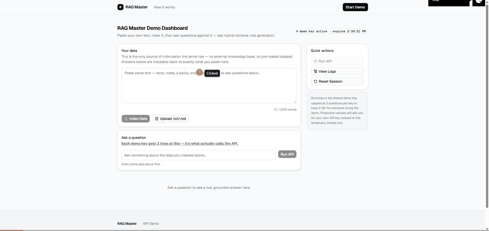

# RAG Master AI Tools

[](https://github.com/Vijayreddymettu/rag-master-ai-tools/actions/workflows/ci.yml)
[](LICENSE)

A live, hands-on demo of a hybrid-retrieval RAG (Retrieval-Augmented Generation) pipeline:
paste or upload your own text, index it, then ask questions against it — semantic vector
search combined with keyword (BM25) search, fused together, answered by an LLM that's
grounded strictly in your own sources. No external knowledge base, no pre-loaded dataset —
every answer traces back to text you provided in the session.



**Live demo:** the site is deployed and access-gated behind a shared passphrase — ask for access.

## What this actually does

1. **Index** — paste or upload text. It's chunked, embedded, and stored.
2. **Retrieve** — a question gets embedded and run through two searches in parallel:
   semantic similarity (pgvector cosine distance) and keyword matching (BM25). The two
   ranked lists are fused with Reciprocal Rank Fusion, so a chunk that both methods agree on
   floats to the top without needing directly comparable scores from either side.
3. **Generate** — the top-ranked chunks are handed to an LLM with an explicit instruction to
   answer only from what's there. The dashboard shows the answer, every source chunk used,
   which retrieval method(s) actually found each one, live latency and status, and the raw
   JSON response — nothing about how the pipeline behaves is hidden.

## Architecture

```
your text  →  chunker  →  OpenAI embeddings  →  Postgres/pgvector
                                                        │
your question  →  OpenAI embeddings  →  ┌──────────────┴──────────────┐
                                         │  semantic search (pgvector) │
                                         │  keyword search (BM25)      │
                                         └──────────────┬──────────────┘
                                                         │
                                          Reciprocal Rank Fusion (top-K)
                                                         │
                                        LLM generation, grounded in sources only
                                                         │
                                          answer + sources + data lineage
```

Everything runs as a single Next.js app on Vercel — API routes, the retrieval logic, and the
UI all live in one deployable unit, backed by a hosted Postgres (Neon) with the `pgvector`
extension.

## This started as a Python tutorial

The retrieval logic here is a TypeScript port of an earlier project
([`rag-tutorial`](https://github.com/Vijayreddymettu/rag-tutorial)) that ran the same idea
locally in Python. Porting it changed a few things, each for a specific reason:

| | Original (Python) | This version | Why |
|---|---|---|---|
| Embeddings | Local BGE model (`sentence-transformers`) | OpenAI `text-embedding-3-small` API | No local ML model to load inside a serverless function |
| Keyword search | `rank_bm25` | Hand-rolled BM25 (no dependency) | BM25 is just term-frequency math — trivial to port directly |
| Re-ranking | Cross-encoder (`ms-marco-MiniLM`) | Reciprocal Rank Fusion | The cross-encoder has no lightweight JS equivalent without a separate model-serving service, which would defeat the point of a single-deploy app |
| Vector store | Local Docker Postgres/pgvector | Neon (hosted Postgres/pgvector) | Vercel can't reach `localhost` — production needs a real hosted database |
| Generation | OpenAI chat completion | Same | No change needed |

## Engineering decisions worth explaining

Most of the porting decisions are summarized in the table above. Two of them came from a real
bug or a real constraint, not just a mechanical port — worth telling as their own stories.

### Why RRF instead of the original's cross-encoder re-ranker

The original Python tutorial re-ranked its top candidates with a cross-encoder
(`ms-marco-MiniLM`) — a small model that scores a (question, chunk) pair directly, usually a
meaningful quality bump over a plain similarity ranking. There's no lightweight JS equivalent
that runs in-process; the realistic options were standing up a separate model-serving service
just for re-ranking, or dropping re-ranking and living with whatever the raw semantic ranking
gave you.

Neither felt right, so this version uses Reciprocal Rank Fusion instead: run semantic search
and BM25 independently, then combine the two ranked lists by summing `1 / (k + rank)` per chunk
across whichever list(s) it appears in (`src/lib/rag/retriever.ts`). It isn't a re-ranker in the
cross-encoder sense — it never looks at the actual text, only at rank positions — but it gets a
real, specific benefit a single ranking can't: a chunk that both semantic search *and* BM25
independently agree on outranks a chunk only one of them found, without needing to normalize
two differently-scaled scores against each other. It's also free — no extra model, no extra
network hop, just arithmetic over two lists already being computed. The dashboard's "data
lineage" panel, which shows which method(s) actually found each source chunk, is really RRF's
fusion decision made visible.

### The in-memory rate limiter that passed every local test and failed in production

The "3 tries per demo key" limit was first built on the rate limiter already used elsewhere in
the app (`src/lib/demo-rate-limit.ts`) — an in-memory `Map` keyed by session id. It passed every
local test: run the dev server, ask 4 questions, the 4th gets rejected, exactly as intended.

It didn't hold once deployed. Vercel runs serverless functions as multiple concurrent
instances, each with its own separate memory — there's no guarantee two requests from the same
visitor land on the same instance. Tested directly against the live deployment with a sequence
of requests: the count reset partway through, because a later request landed on an instance
that had never seen that session before. Passing every local test meant nothing, because local
dev only ever runs one process.

The fix was moving the counter into Postgres — the one thing every instance actually shares —
using a single atomic statement (`src/lib/rag/ask-limit.ts`):

```sql
INSERT INTO demo_ask_counts (session_id, count)
VALUES ($1, 1)
ON CONFLICT (session_id) DO UPDATE SET count = demo_ask_counts.count + 1
RETURNING count
```

Re-verified the same way the bug was found — several consecutive requests against the live
deployment, not just local dev. The general lesson stuck around: a hard limit needs a shared
datastore behind it, and "it works locally" doesn't prove anything about a multi-instance
production environment. The only way to know is to test against it directly.

## Retrieval quality: hybrid vs. semantic-only

`npm run evaluate` (`scripts/evaluate-retrieval.ts`) indexes a small hand-written corpus and
measures Recall@1, Recall@3, and MRR for two configurations, calling the same `retriever.ts`
code the live app uses — not a reimplementation:

- **Semantic-only** — pgvector cosine search alone.
- **Hybrid** — semantic + BM25, RRF-fused (what the app actually runs).

The test corpus is deliberately adversarial in one spot: four near-identical "product spec"
documents (`Model X100`–`X400`) that differ almost entirely in a single model-number token — a
known stress case, since a short numeric token carries little semantic weight on its own, so
near-duplicate passages can end up clustered close together in embedding space.

Real, measured results on a 12-document / 45-chunk corpus, 8 questions (`TOP_K = 3`, matching
`ask.ts`'s actual configuration):

| | Recall@1 | Recall@3 | MRR |
|---|---|---|---|
| Semantic search only | 100% | 100% | 1.000 |
| Hybrid (semantic + BM25, RRF-fused) | 100% | 100% | 1.000 |

Both configurations answered every question correctly, including the near-duplicate
model-number set — `text-embedding-3-small` handled that case better than expected. At this
corpus size, there just isn't enough competing content to actually confuse it. That's the real
result, not a rigged one, and it's worth reporting honestly rather than shrinking the corpus
until it manufactures a bigger gap.

That doesn't make the hybrid approach pointless — it just means the case for it here isn't "it
scores higher on this 12-document eval." The real case is:

- **RRF is a strict addition, never a subtraction.** A chunk found by only one method still
  surfaces; a chunk both methods agree on ranks higher. There's no scenario where fusing in a
  second signal makes the result worse than either signal alone.
- **It's what makes the "data lineage" feature meaningful.** The dashboard shows which
  method(s) found each source chunk — that's only informative because both are genuinely being
  computed, not because one clearly wins.
- **The known gap shows up at a scale this eval doesn't reach.** BM25's edge over dense
  embeddings on exact identifiers, codes, and rare tokens is well-documented in IR literature,
  and generally widens as the candidate pool grows into the hundreds or thousands of documents
  — a regime a 12-document demo corpus doesn't test. A larger, noisier corpus would be the
  natural next step for a more demanding version of this eval.

Run it yourself with `npm run evaluate` (needs `DATABASE_URL` and `OPENAI_API_KEY` in
`.env.local`) — it indexes into a throwaway session and cleans up after itself.

## Testing

```bash
npm test        # vitest — BM25, chunking, RRF fusion, demo/access token signing, rate limiting
npx tsc --noEmit
npm run lint
```

All three run in CI (`.github/workflows/ci.yml`) on every push and pull request. The token
tests in particular are regression coverage for a real bug: an earlier version of the
site-wide access gate signed the payload before base64url-encoding it, then verified the
signature against the encoded form — two different byte strings, so no correct passphrase could
ever pass. `src/lib/site-access.test.ts` pins that round trip so it can't silently regress.

## Access model

This is a public-facing demo, not a finished product — so it's deliberately simple:

- **The whole site sits behind a shared passphrase gate** (`src/proxy.ts`), separate from
  everything else below it. That's an intentional access-control layer, not a product
  feature — it controls who gets to see the demo at all.
- **Once inside, visitors get a temporary "demo key"** — a stateless, signed, short-lived
  token (`src/lib/demo-session.ts`). It isn't a product API key or a database row; it just
  scopes each visitor's indexed data so different sessions never mix, and rate-limits how
  hard any one session can hit the shared OpenAI key behind the scenes.
- **The internal OpenAI key never reaches the browser.** Every visitor is currently using
  the same server-side key. A real product would eventually ask each customer for their own
  key instead of sharing one — that's future scope, not built here.

## Local development

```bash
npm install
cp .env.example .env.local   # fill in OPENAI_API_KEY, DEMO_SESSION_SECRET, ACCESS_PASSPHRASE
docker run -d --name pgvector -e POSTGRES_PASSWORD=password -p 5432:5432 ankane/pgvector
npm run dev
```

Open the dev server, enter the passphrase you set, generate a demo key, paste some text,
index it, and ask a question. See `.env.example` for what each variable does and which ones
can be left blank locally.

## Deployment

Deployed on Vercel with a hosted Neon Postgres provisioned through the Vercel Marketplace
(`vercel integration add neon`, which auto-injects `DATABASE_URL`). Beyond that, the project
needs `OPENAI_API_KEY`, `DEMO_SESSION_SECRET`, and `ACCESS_PASSPHRASE` set in the Vercel
project's environment variables before deploying.

## License

**All Rights Reserved — Copyright (c) 2026 Vijay Mettu.** No license is granted.

In plain English: this code is public so you can read it and see how it's built, but you don't
have permission to copy, modify, deploy, or sell it — for that, ask first.

- **You may:** view and read the source, and reference it when evaluating the author's skills
  and experience.
- **You may not**, without prior written permission: copy, redistribute, modify, create
  derivative works, deploy or host it (in whole or in part), or commercialise it.

To request permission, contact the copyright holder via GitHub
([@Vijayreddymettu](https://github.com/Vijayreddymettu)). Full terms in [`LICENSE`](LICENSE).
